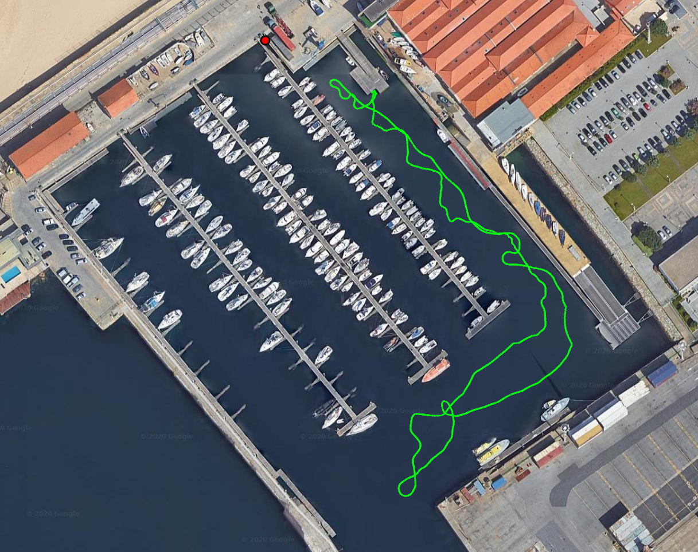
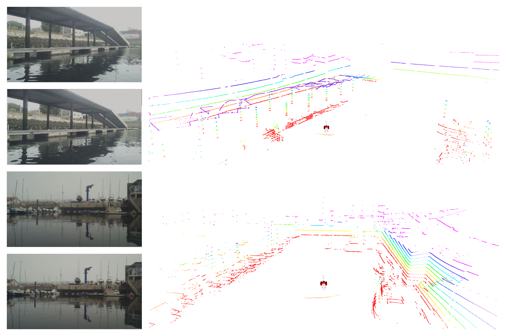

<p align="left">


</p>

# README #

* Name:ROAM@CRAS - A haRbor multidOmAin Mapping dataset
* Rep: https://github.com/danielfbcampos/ROAM-CRAS

### What is this repository for? ###

The ROAM repository provides the transforms and dependencies required to play the ROAM@CRAS dataset, the first multi-domain dataset publicly available. The full data repository can be downloaded from:

   * https://rdm.inesctec.pt/dataset/nis-2020-002 

The ROAM@CRAS dataset was acquired using an Autonomous Surface Vehicle (ASV), SENSE (video link below), equipped with a set of incorporated sensors for perceiving the surface and underwater domains (Velodyne VLP-16, Mynt Eye D and Imagenex ”Delta T” 837B) as well as navigation sensors such as L1/L2 RTK, GPS and IMU. This dataset was acquired during a campaign of the project DIIUS (Distributed perceptIon for inspectIon of aqUatic Structures) on the harbor of Marina de Leça, Porto, Portugal (https://goo.gl/maps/nHz9mA9Thqii6sy99). The ASV was remotely operated at all time performing a trajectory with distinct challenges for 3D mapping and sensor fusion applications, such as data imperfecteness, inconsistency and heterogeneity. All data was recorded using ROS bags each with ~14s duration to be played in sequence all together taking up to the total mission time (~1196s). The dataset provides a perspective of both domains available on the maritime environment, namely the surface and the underwater domains, giving essencial research data for maritime robotic platforms to increase the situational awareness and enhance the 3D mapping capacities to provide a more complete representation of the surroundings. 

Each bag is composed by the following topics:

   * /cmd_vel: geometry_msgs/Twist - Velocity command from the control station

   * /gps/basestation_ecef: nav_msgs/Odometry - Swift Navigation Piksi Multi RTK base station position in ECEF

   * /gps/fix: sensor_msgs/NavSatFix - Swift Navigation Piksi Multi GPS position

   * /gps/rtkfix: nav_msgs/Odometry - SENSE Swift Navigation Piksi Multi GPS RTK odometry

   * /gps/time: sensor_msgs/TimeReference -Swift Navigation Piksi Multi GPS Time reference

   * /imu/data: sensor_msgs/Imu - Xsens MTi-30 IMU data

   * /imu_nav/data: sensor_msgs/Imu - Sparkfun Razor IMU 9DOF data

   * /left/cmd: roboteq_msgs/Command - Left thruster command for Roboteq

   * /mbes/scan: sensor_msgs/LaserScan - Imagenex ”Delta T” 837B scan

   * /mynteye/depth/camera_info: sensor_msgs/CameraInfo - Mynt Eye D camera parameters

   * /mynteye/depth/image_raw: sensor_msgs/Image - Mynt Eye D depth image

   * /mynteye/left/image_color/compressed: sensor_msgs/CompressedImage - Mynt Eye D left image

   * /mynteye/right/image_color/compressed: sensor_msgs/CompressedImage - Mynt Eye D right image

   * /right/cmd: roboteq_msgs/Command - Right thruster command for Roboteq

   * /roboteq_driver/status: roboteq_msgs/Status - Roboteq status feedback

   * /safety_stop: std_msgs/Bool - Emergency failsafe status

   * /ublox_nav/fix: sensor_msgs/NavSatFix - Vk-162 Glonass Navigation USB GPS position data

   * /ublox_nav/fix_velocity: geometry_msgs/TwistWithCovarianceStamped - Vk-162 Glonass Navigation USB GPS velocity data

   * /velocity: geometry_msgs/TwistStamped - Angular velocity published by the Xsens MTi-30 IMU

   * /velodyne_points: sensor_msgs/PointCloud2 - Velodyne VLP-16 Point cloud


[](https://youtu.be/vkJ-MVCSpdA)

https://youtu.be/vkJ-MVCSpdA

This software is acquired using:
   * Ubuntu 18.04
   * ROS Melodic
   * Eigen 3

### Data samples

***SENSE trajectory acquired with RTK***



***SENSE Stereo LiDAR and MBES sample***



***SENSE RVIZ data sample***


***SENSE bathymetry sample***


### Running

To run go to the dataset folder and execute on two different terminals:

````
    roslaunch transforms tfs_sense.launch

    rosbag play --clock harbor_*
````

### Who do I talk to? ###

   * Daniel Campos ([daniel.f.campos@inestec.pt](mailto:daniel.f.campos@inestec.pt))
   * Andry Pinto ([andry.m.pinto@inestec.pt](mailto:andry.m.pinto@inestec.pt))

